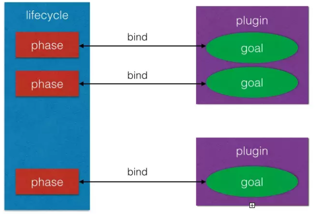
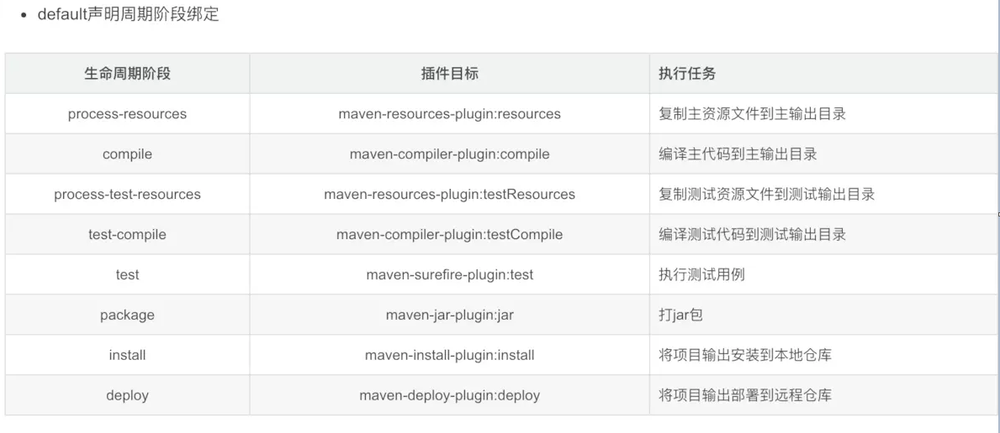

# Maven笔记

## 基本概念
Maven就是是专门为Java项目打造的管理和构建工具，它的主要功能有：
- 提供了一套标准化的项目结构；
- 提供了一套标准化的构建流程（编译，测试，打包，发布……）；
- 提供了一套依赖管理机制。

**Maven项目的默认结构** 一个使用Maven管理的普通的Java项目，它的目录结构默认如下：
```text
a-maven-project
├── pom.xml
├── src
│   ├── main
│   │   ├── java
│   │   └── resources
│   └── test
│       ├── java
│       └── resources
└── target
```
项目的根目录a-maven-project是项目名，它有一个项目描述文件pom.xml，存放Java源码的目录是src/main/java，存放资源文件的目录是src/main/resources，存放测试源码的目录是src/test/java，存放测试资源的目录是src/test/resources，最后，所有编译、打包生成的文件都放在target目录里。这些就是一个Maven项目的标准目录结构。

**Maven依赖关系**
scope | 说明 | 示例
-|-|-
compile | 编译是需要用到该jar包（默认） | commons-logging
test | 编译Test时需要用到该jar包 | junit
runtime | 编译时不需要，但运行时需要用到 | mysql
provided | 编译时需要用到，但运行时需要由JDK或者某个服务器提供 | servlet-api

**常用命令**

在实际开发过程中，经常使用的命令有：

`mvn clean`：清理所有生成的class和jar；

`mvn clean compile`：先清理，再执行到compile；

`mvn clean test`：先清理，再执行到test，因为执行test前必须执行compile，所以这里不必指定compile；

`mvn clean package`：先清理，再执行到package。

大多数phase在执行过程中，因为我们通常没有在pom.xml中配置相关的设置，所以这些phase什么事情都不做。经常用到的phase其实只有几个：
- clean：清理
- compile：编译
- test：运行测试
- package：打包

## POM

**pom**（Project Object Model项目对象模型）

一个pom对象包括了groupId、artifaceId、version、classifier、type（也叫packaging）五部分, pom.xml其实就是Project Object Model的xml描述。其中，groupId类似于Java的包名，通常是公司或组织名称，artifactId类似于Java的类名，通常是项目名称，再加上version。其中**groupId，artifactId和version作为唯一标识**。

## LifeCycle
Maven 拥有三套相互独立的生命周期: clean、default 和 site, 而每个生命周期包含一些phase阶段, 阶段是有顺序的, 并且后面的阶段依赖于前面的阶段. 而三套生命周期相互之间却并没有前后依赖关系, 即调用site周期内的某个phase阶段并不会对clean产生任何影响.

**这三个lifecycle定义了其包含的phase。maven会在这三个lifecycle中匹配对应的phase。当执行某个phase时，maven会依次执行在这个phase之前的phase。**

### default lifecycle的phase

**Maven**的默认构建过程对应一个**Lifecycle**, 这个lifecycle分为多个阶段，每个阶段叫做**Phase**且按以下顺序执行：
- validate： 用于验证项目的有效性和其项目所需要的内容是否具备
- initialize：初始化操作，比如创建一些构建所需要的目录等。
- generate-sources：用于生成一些源代码，这些源代码在compile phase中需要使用到
- process-sources：对源代码进行一些操作，例如过滤一些源代码
- generate-resources：生成资源文件（这些文件将被包含在最后的输入文件中）
- process-resources：对资源文件进行处理
- compile：对源代码进行编译
- process-classes：对编译生成的文件进行处理
- generate-test-sources：生成测试用的源代码
- process-test-sources：对生成的测试源代码进行处理
- generate-test-resources：生成测试用的资源文件
- process-test-resources：对测试用的资源文件进行处理
- test-compile：对测试用的源代码进行编译
- process-test-classes：对测试源代码编译后的文件进行处理
- test：进行单元测试
- prepare-package：打包前置操作
- package：打包
- pre-integration-test：集成测试前置操作   
- integration-test：集成测试
- post-integration-test：集成测试后置操作
- install：将打包产物安装到本地maven仓库
- deploy：将打包产物安装到远程仓库

> 在maven中，当你执行任何一个phase时，maven会将其之前的phase都执行.例如*mvn install*那么Maven会将*deploy*之外的所有phase按照他们的执行顺序执行(validate -> initialize -> ... -> deploy)

### goal

**Lifecycle**定义有疑义了一套构建流程规范（validate -> initialize -> .... ->complie -> test ...），但是没有未每个phase指定具体应该如何操作，phase只是规定了契约但是没有定义具体的动作（类似声明接口）。这里具体的由**goal**定义实现，一个**goal**在maven中就是一个Mojo(Maven old java object),Mojo抽象类中定义了一个**excute()**方法，一个goal的具体动作就是在excute()方法中实现，Mojo包含于**maven plugin**中。

*在执行具体构建是，我们需要为lifecycle的每个phase绑定一个goal，例如life中有个compile phase规定了构建的流程，而maven-compile-plugin这个plugin有个compile goal就是用javac来将源文件.java编译成.class字节码文件的。 **compile**这个phase与**maven-compile-plugin**的绑定如下：*

```xml
<build>
<plugins>
  <plugin>
    <artifactId>maven-myquery-plugin</artifactId>
    <version>1.0</version>
    <executions>
      <execution>
        <id>execution1</id>
        <phase>test</phase>
        <configuration>
          <url>http://www.foo.com/query</url>
          <timeout>10</timeout>
          <options>
            <option>one</option>
            <option>two</option>
            <option>three</option>
          </options>
        </configuration>
        <goals>
          <goal>query</goal>
        </goals>
      </execution>
    </executions>
  </plugin>
</plugins>
</build>
```

以下图形展示了maven lifecycle，phase，goal之间的关系:



`lifecycle`相当于Java的package，它包含一个或多个phase；

`phase`相当于Java的class，它包含一个或多个goal；

`goal`相当于class的method，它其实才是真正干活的。

### 内置绑定
为了让用户几乎不用任何配置就能使用Maven构建项目，Maven默认为一些核心生命周期绑定了插件目标。 


### 自定义绑定
除了内置绑定，还支持用户自定义绑定,  如创建项目的源码包, maven-source-plugin插件的jar-no-fork目标能够将项目的主代码打包成jar文件, 可以将其绑定到verify阶段上:
```xml
<build>
    <plugins>
        <plugin>
            <groupId>org.apache.maven.plugins</groupId>
            <artifactId>maven-source-plugin</artifactId>
            <version>3.0.0</version>
            <executions>
                <execution>
                    <id>attach-sources</id>
                    <phase>verify</phase>
                    <goals>
                        <goal>jar-no-fork</goal>
                    </goals>
                </execution>
            </executions>
        </plugin>
    </plugins>
</build>
```

### 聚合与继承


## Maven自定义Plugin开发

## 参考
- https://www.jianshu.com/p/b07e7dbd8e4c
- https://www.liaoxuefeng.com/wiki/1252599548343744/1309301146648610